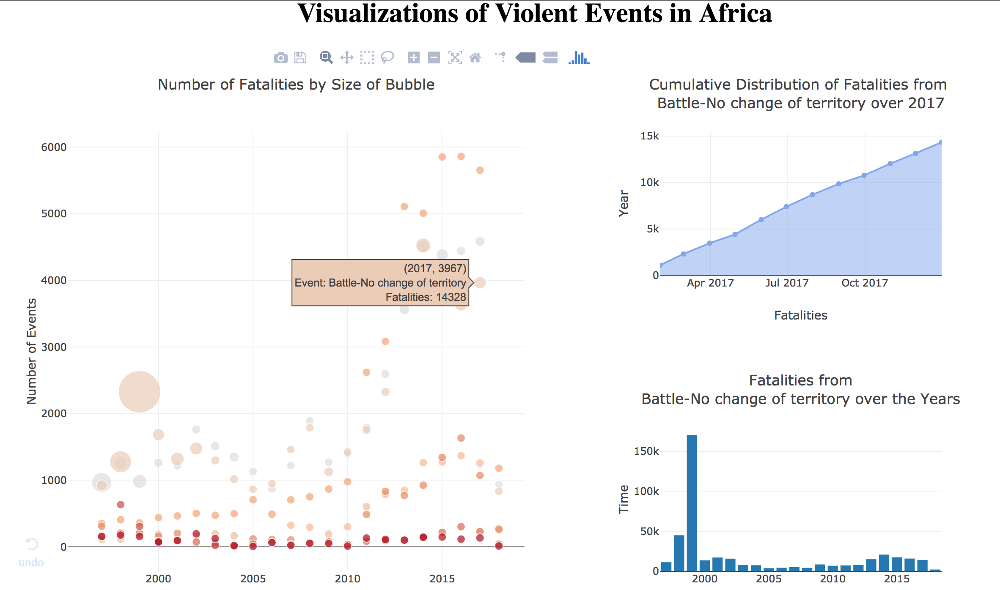

## Project Description
This provides an interactive dashboard interface to allow for a quick scanning of the fatalities induced by violent events in Africa.

It was built with Plot.ly's [Dash](https://dash.plot.ly/) library, which is a pretty nice reactive Python interface that compiles down into a React.js app with a Flask backend.

## Motivation
This started off as a homework assignment in R, and evolved into something way bigger. I really liked the bubble chart I built and wondered if I could take it further. This is me taking it further.

## Interesting Finding
The [Eritrean-Ethiopian](https://en.wikipedia.org/wiki/Eritrean–Ethiopian_War) War of May 1998 to June 2000
caused an insane spike in the number of deaths in 1999 in particular. I had no knowledge of this war before
exploring the dataset and chancing upon the outlier it caused.

Looking further into it (both from online research, and further visualizations based off of the dataset),
it's quite a horrible war two ways even crueler than most wars. They're as follows:

1. Eritrea and Ethiopia were (are) among the poorest countries in the world. The war cost them millions of
dollars they just *could not* afford, and resulted in hundreds of thousands of deaths.

1. There was negligible border change due to the war. Put perhaps a little too morbidly, all these people died to
effect no lasting change in the world. Easily verifiable using the ACLED dataset is the fact that most of these lives
were lost in battles that themselves led to no territory shifts.

## Reflection
Wars are horrible. This dataset has far more than wars, but I'm going to focus on wars anyway. I was a soldier for two years in the Singapore army, but I still barely know anything about
the brutality and pyschology of war beyond some distant, abstract concept I gathered from a combination of
empathy, books and TV (the Singapore Army hasn't ever seen that sort of conflict). 

But there's this quote from Call of Duty 2 (one of my favorite games when I was a kid) that stuck in my head.
When I died in the game, it would flash a random choice from a selection of quotations on the screen. Most of these
quotes were attributed to people, but the most profound one wasn't attributed to anyone.

> War determines who is left, not who is right.

This particular war, however, seems not to have done even that, and there were far too few people left. I need to do more
research to understand the context and motivations better, but this whole exercise I took on was a nice reminder
of the power of data (particularly over me. I'm much better swayed by quantitative information than by rhetoric).

So yeah, this was definitely worth the sleep loss and unnecessary effort.
